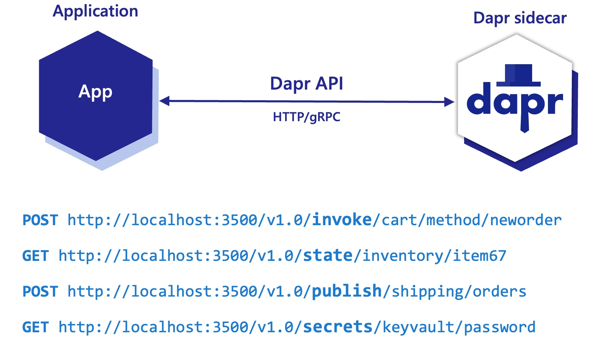

Dapr -  Distributed Application Runtime
===

Dapr is a portable, event-driven runtime that makes it easy for any developer to build resilient, stateless, and stateful applications




## Local Setup/Build

```bash
docker build -t productsapi:latest .
```

```bash
kubectl apply -f k8s-secrets.yaml
kubectl apply -f k8s-deployment.yaml
kubectl get pods
```


## Setup with remote Docker Hub deployment and GitHub Actions

```bash
docker build -t your-dockerhub-username/productsapi .
docker push your-dockerhub-username/productsapi
```

```bash
kubectl apply -f k8s-secrets.yaml
kubectl apply -f k8s-deployment.yaml
kubectl get pods
```
